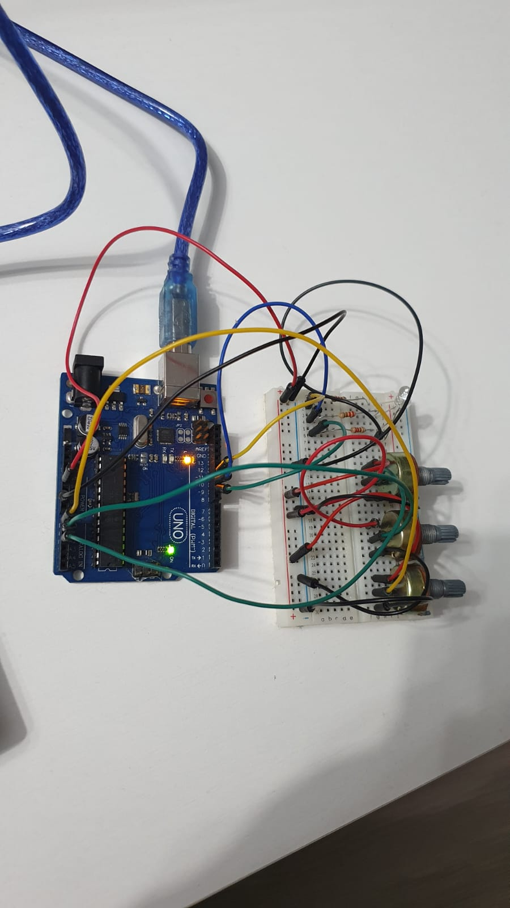
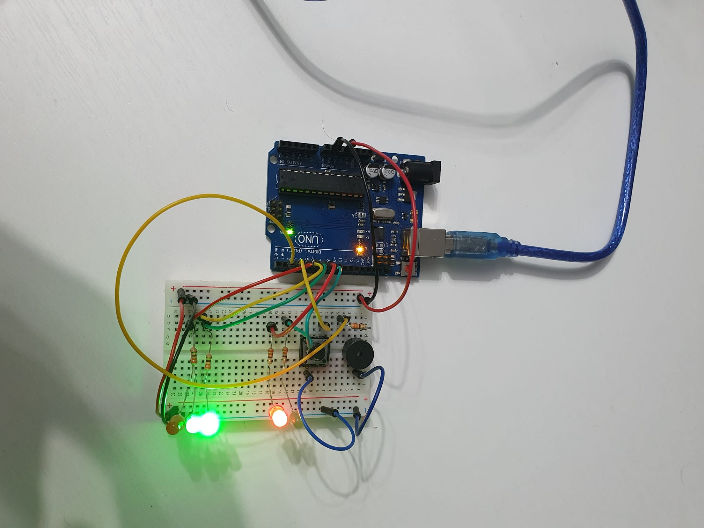

# IntroductionToRobotics
Tasks completed in the Introduction to Robotics course.

### Homework #0
Setting up this repository and installing Arduino IDE

### Homework #1

#### Task requirements
Control a RGB LED using 3 potentiometers.

#### Picture

#### Video

### Homework #2

#### Task requirements
Build  the  traffic  lights  for  a  crosswalk. The system has the following states:
  - bState 1b: Cars crossing  green light for cars,red  light  for  people,  no  sounds.   Duration:  indefinite,  changed  bypressing the button. 
  - bState 2b: Cars stopping (the  light  should  be  yellow  for  cars,  red  for  people  and  no  sounds.) -> Duration: 3s.
  - *State 3*: Pedestrians crossing (red for cars, green for peopleand a beeping sound from the buzzer at a constant interval) -> Duration: 8s.
  - *State 4*: Last seconds for pedestrians crossing (red for cars,blinking greenfor people and a beeping sound from the buzzer,  at a constant in-terval,  faster than the beeping in state 3) -> Duration: 4s. GO TO State 1.

 

#### Picture

#### Video

