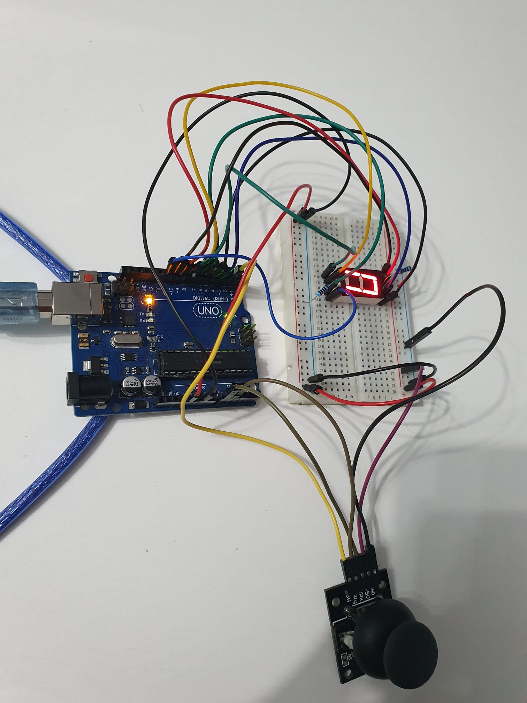
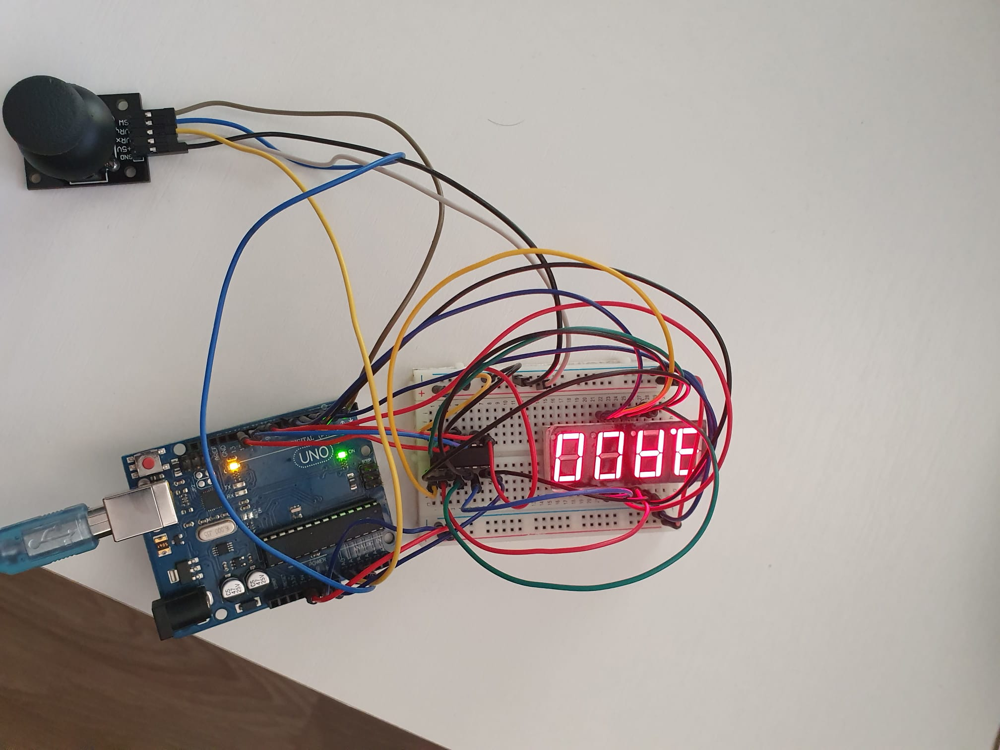

# IntroductionToRobotics
Tasks completed in the Introduction to Robotics course.

### Homework #0
Setting up this repository and installing Arduino IDE

### Homework #1

#### Task requirements
Control a RGB LED using 3 potentiometers.

#### Picture

#### Video

### Homework #2

#### Task requirements
Build  the  traffic  lights  for  a  crosswalk. The system has the following states:
  - **State 1**: Cars crossing  green light for cars,red  light  for  people,  no  sounds.   Duration:  indefinite,  changed  bypressing the button. 
  - **State 2**: Cars stopping (the  light  should  be  yellow  for  cars,  red  for  people  and  no  sounds.) -> Duration: 3s.
  - **State 3**: Pedestrians crossing (red for cars, green for peopleand a beeping sound from the buzzer at a constant interval) -> Duration: 8s.
  - **State 4**: Last seconds for pedestrians crossing (red for cars,blinking greenfor people and a beeping sound from the buzzer,  at a constant in-terval,  faster than the beeping in state 3) -> Duration: 4s. GO TO State 1.

 

#### Picture

#### Video

### Homework #3
Use the joystick to control the position ofthe segment and ”draw” on the display.  The movement between segmentsshould be natural (meaning they should jump from the current positiononly to neighbors, but without passing through ”walls”:
- **State 1**: (default,  but  also  initiated  after  a  button  press  in  State2):  Current  position  blinking.   Can  use  the  joystick  to  move  fromone  position  to  neighbors.   Short  pressing  the  button  toggles  state2.  Long pressing the button in state 1 resets the entire display byturning all the segments OFF and moving the current position to thedecimal point
- **State 2**:(initiated  after  a  button  press  in  State  1):   The  currentsegment  stops  blinking,  adopting  the  state  of  the  segment  beforeselection (ON or OFF). Toggling the X (or Y, you chose) axis shouldchange  the  segment  state  from  ON  to  OFF  or  from  OFF  to  ON.Clicking the joystick should save the segment state and exit back tostate 1
  
  
 
 #### Picture
 

#### Video

### Homework #4
Use the joystick to move through the 4 digit 7segment displays digits, press the button to lock in on the current digitand use the other axis to increment or decrement the number.  Keep thebutton pressed to reset all the digit values and the current position to thefirst digit in the first state.
- **State 1**:you can use a joystick axis to cycle through the 4 digits;using the other axis does nothing.  A blinking decimal point showsthe current digit position.  When pressing the button, you lock in onthe selected digit and enter the second state.
- **State 2**:in this state, the decimal point stays always on, nolonger blinking and you can no longer use the axis to cycle throughthe  4  digits.   Instead,  using  the  other  axis,  you  can  increment  ondecrement  the  number  on  the  current  digit  IN  HEX  (aka  from  0to F, as in the lab).  Pressing the button again returns you to theprevious state.  Also, keep in mind that when changing the number,you  must  increment  it  for  each  joystick  movement  -  it  should  notwork continuosly increment if you keep the joystick in one position(aka with joyMoved).
Reset:  toggled by long pressing the buttononly in the first state.When resetting, all the digits go back to 0 and the current positionis set to the first (rightmost) digit, in the first state.

  

#### Picture

#### Video

